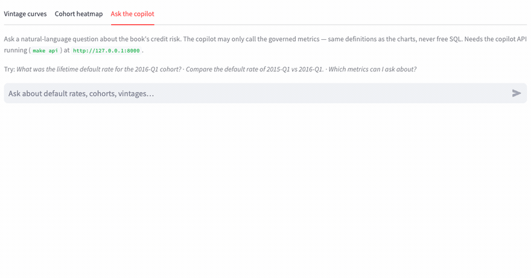
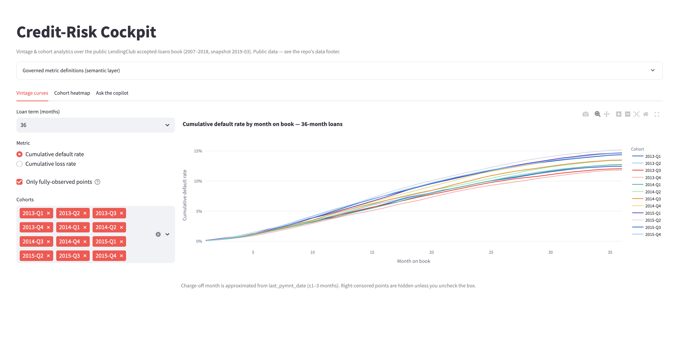
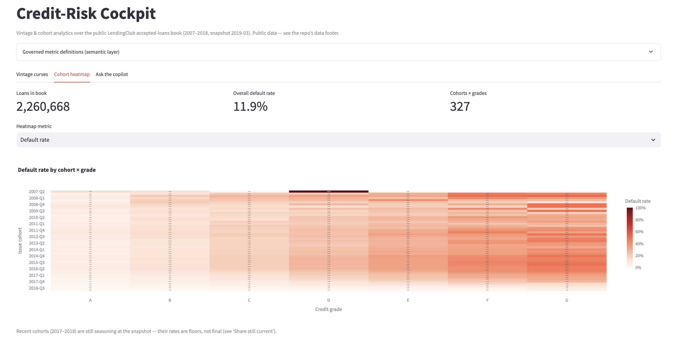

# Credit-Risk Cockpit

A credit-risk cockpit for a consumer-lending book: vintage default curves and cohort
heatmaps in BI (with a DTI affordability lens), plus an agentic copilot that answers risk
questions in natural language over a governed dbt semantic layer.

**▶ Live demo:** https://credit-risk-cockpit-kpn2dzalva-uc.a.run.app
_(Cloud Run, scale-to-zero — the first request after a cold start takes a few seconds to wake the container.)_

**Why it stands out:** it pairs the day-to-day of cohort/vintage credit analytics with a
differentiator — a governed text-to-metric agent that answers "why did the Q3-2021
cohort's default rate lift vs Q2?" by calling typed MCP tools over shared metric
definitions, not by writing raw SQL against live tables.



_The differentiator in 10 seconds: ask the copilot why a cohort moved, and it queries the
same governed metrics as the BI layer and names the tool behind every figure — governed
text-to-metric, never raw text-to-SQL._

> **Companion flagship —** [card-acquisition-funnel](https://github.com/mativazques/card-acquisition-funnel)
> covers the *other half* of the card lifecycle (acquisition → adoption → retention) with a
> **proactive multi-agent insight layer** and a deterministic data-honesty critic. Same
> governed-metric DNA, different domain — together they read as one card-lifecycle platform.

---

## What It Does

- **Vintage curves + cohort heatmaps (BI standing views):** dbt-powered marts render
  cumulative default rates by months-on-book and cohort quarter — the core view a risk
  manager opens every morning.
- **Natural-language copilot:** ask "why did Q3-2021 lift?" and the agent decomposes the
  question, queries the same governed metrics as the BI layer, compares cohorts, and
  narrates the driver.
- **Shared semantic layer:** `default_rate`, `cumulative_loss_rate`, `cohort_size`,
  `avg_dti`, `charge_off_rate` — defined once in dbt, consumed identically by the BI
  dashboard and the agentic copilot.
- **Roll-rate matrix (BI + copilot):** monthly delinquency transition probabilities per cohort, over a clearly-labeled synthetic path.
- **Early-warning backtest (BI + copilot):** each cohort's mature 36-MOB default predicted from its 12-MOB rate, validated out-of-sample on held-out cohorts.
- **Affordability stress (BI + copilot):** the share of each cohort breaching a DTI threshold under a hypothetical income shock, computed closed-form on the book's own origination DTI.
- **Business-plan projection** — scenario sliders (volume growth, credit-mix shift, macro stress in bp) over the mature 36-month loss curve, with a P&L-style summary (projected origination, terminal loss rate, expected loss) and a downloadable scenario table — the "projecting business curves with stakeholders" view.

---

## Why It Matters

Credit-risk teams lose money in the gap between when a cohort starts underperforming and
when someone notices it. This cockpit shortens that detection lead-time: the *same*
governed metrics power both the standing BI views a risk manager reads every morning and
an agent that can be **asked**, in plain language, why a cohort moved and what drove it.
One governed definition, two surfaces — so a diagnosis is never at odds with the dashboard.

Because it runs scale-to-zero (~$0 idle), even a few basis points of avoided loss on the
book it influences more than covers the run cost. The full value model — pilot anchor,
rollout ladder, sensitivity table and TCO — lives in [BLUEPRINT.md](BLUEPRINT.md), stated
as an illustrative case on a public dataset, not a live book.

---

## Screenshots / Demo

Try it live: **https://credit-risk-cockpit-kpn2dzalva-uc.a.run.app**

**Vintage curves** — cumulative default rate by month-on-book, one line per issue
cohort. Right-censored points are hidden by default so cohorts are compared on equal
footing.



**Cohort × grade heatmap** — default rate across issue quarter and LendingClub credit
grade over the full 2.26M-loan book, with the governed metric definitions one click away.



**Ask the copilot** — see the GIF at the top: a natural-language question answered only
from the governed tools (`list_metrics`, `query_metric`, `compare_cohorts`, `query_roll_rate`, `query_affordability`, `project_scenario`). Every answer
states the numbers, the driver, and which governed tool it called, so each figure is
traceable back to a single metric definition — no free-form SQL, no invented numbers.

---

## Architecture

```
                    ┌──────────── Airflow (orchestration) ────────────┐
                    │  ingest → dbt run → dbt test  (via Cosmos)       │
                    └──────────────────────┬──────────────────────────┘
                                           ▼
Kaggle CSV → GCS (raw) → BigQuery (raw)
                          → dbt (staging → intermediate → marts + semantic layer)
                          → Streamlit  (BI cockpit + chat)
                          → FastAPI + Gemini (Vertex AI) + MCP  (agentic copilot)
                          → Cloud Run (deploy, min-instances=0)   ·   Terraform (IaC)
```

dbt models are rendered as individual Airflow tasks via **astronomer-cosmos**, so the
DAG mirrors the dbt lineage graph — the modern pattern NL/DE data teams expect.

**Deploy shape.** The whole app ships as **one scale-to-zero Cloud Run container**
(`min-instances=0` → $0 idle, `max-instances` capped). Terraform owns only the **serving**
layer (Artifact Registry, a least-privilege runtime service account with read-only
BigQuery access, the Gemini secret, the Cloud Run service); the **data** layer is left as
bootstrapped by the pipeline, so re-declaring it in IaC can't destroy loaded data. (The
container runs two isolated venvs to resolve a Streamlit/copilot dependency conflict; the
loopback wiring (C4.1) and the gVisor SIGSEGV fix (C4.3b) are written up in
[docs/roadmap.md](docs/roadmap.md).)

---

## Stack

Python · SQL · BigQuery · dbt · Airflow (Cosmos) · FastAPI · Gemini (Vertex AI) · MCP · Streamlit · Cloud Run · GCP · Terraform

---

## How to Run

### Prerequisites

- A free [Kaggle account](https://www.kaggle.com) → *Account → Create New Token* to get
  `KAGGLE_USERNAME` / `KAGGLE_KEY`.
- A GCP project on your own account, with the **BigQuery** and **Cloud Storage** APIs
  enabled. Create the GCS bucket and BigQuery dataset in a **US region** (`us-central1`)
  so they stay inside the GCS 5 GB and BigQuery 10 GB Always-Free tiers.
- `cp .env.example .env` and fill in the values.

### Phase 0 — Ingestion (Kaggle → GCS → BigQuery)

The ingestion script is env-driven and runs identically in three places. There is no
native Kaggle→GCS transfer, so the ~1.4 GB CSV is downloaded once, then pushed to GCS
and loaded into BigQuery.

**Recommended — [Google Cloud Shell](https://shell.cloud.google.com)** (free, keeps the
CSV off your laptop; `gcloud`/`gsutil` are pre-installed):

```bash
git clone https://github.com/mativazques/credit-risk-cockpit && cd credit-risk-cockpit
pip install -r scripts/requirements.txt
cp .env.example .env   # then edit .env
python scripts/ingest.py
```

**Or locally** — same commands. **Or in Phase 1+** the same script is wrapped by a Cloud
Run Job / Airflow task. The script is idempotent: it skips the Kaggle download if the
object already exists in GCS and replaces the BigQuery table on load.

**Cost:** GCS 1.4 GB and the BigQuery raw table sit inside the Always-Free tiers → $0/mo.

### Environments

The stack needs **four isolated venvs** because the tools have conflicting pins — each is
created once and the `Makefile` targets point at it. This is the same protobuf/Python
split that the single deploy container reproduces.

```bash
python3   -m venv .venv         && .venv/bin/pip install -r dbt/requirements.txt        # dbt (protobuf>=6)
python3   -m venv .venv-app     && .venv-app/bin/pip install -r app/requirements.txt     # Streamlit (protobuf<6)
python3   -m venv .venv-copilot && .venv-copilot/bin/pip install -r copilot/requirements.txt  # FastAPI + Gemini (protobuf>=6)
python3.12 -m venv .venv-mcp    && .venv-mcp/bin/pip install -r copilot/requirements-mcp.txt   # MCP SDK (needs Python ≥3.10)
```

### Phase 1–2 — dbt models + semantic layer

```bash
make dbt-build        # run + test the whole DAG in lineage order (SELECT=<model> to target one)
make dbt-docs         # generate the dbt docs site
make airflow-start    # optional: local Airflow (Astro + Cosmos) renders each model as a task
```

BigQuery auth is via ADC (`gcloud auth application-default login`). `dbt` reads
`GCP_PROJECT` / `BQ_DBT_DATASET` / `BQ_LOCATION` from `.env`; the marts land in
`<BQ_DBT_DATASET>_marts`.

### Phase 3 — BI cockpit + copilot

```bash
make app              # Streamlit cockpit at localhost:8501 (vintage curves, heatmap, chat tab)
make api              # copilot FastAPI at localhost:8000 (needs GEMINI_API_KEY in .env)
make mcp              # MCP server (stdio) exposing the same governed tools — see docs/mcp.md
make copilot-test     # copilot + semantic unit tests (no LLM, no BigQuery)
make mcp-test         # MCP server unit tests
```

The chat tab calls the copilot API, so run `make api` alongside `make app` for live Q&A.
The copilot only spends tokens on **novel, on-topic** questions (on-topic router +
per-IP/global token caps + answer cache); off-topic questions are refused at zero cost.

### Phase 4 — Container + deploy to Cloud Run

```bash
make docker-build     # build the single image (two venvs) and run it locally
make tf-init tf-bootstrap secret-push image-push deploy   # full deploy runbook → prints the public URL
```

See [terraform/README.md](terraform/README.md) for the per-step deploy runbook and the
cost breakdown. `make teardown` destroys the serving layer (data kept); `make trim` drops
the heavy raw layer while keeping the marts (zero-storage resting state).

---

## Data

LendingClub loan data 2007–2018 from Kaggle
([wordsforthewise/lending-club](https://www.kaggle.com/datasets/wordsforthewise/lending-club)),
licensed **CC0 1.0 Public Domain**, ~2.26M accepted loans.

Vintage and months-on-book metrics are **derived** from the loan-level snapshot via
`issue_d` + `last_pymnt_d` (no monthly payment time series exists in the dataset;
charge-off month is approximated — stated transparently). 2017–2018 originations are
right-censored at the snapshot date and labeled as such.

No proprietary data. Raw CSV not committed to the repo (requires a free Kaggle account
to download). All numbers illustrative with stated assumptions.

**Roll rates are computed over a synthetic delinquency path.** The public LendingClub
snapshot carries only each loan's terminal status, not a monthly DPD history. The state
machine is calibrated so every loan's terminal absorbing state (charged-off / fully-paid)
and its approximate charge-off month match the real observed outcome; only the intermediate
30/60/90-day path between them is generated. Read the roll-rate matrix as an illustrative
transition structure, not observed servicing data.

**The early-warning backtest is a calibrated ratio, not a model.** The 36-MOB default prediction multiplies each cohort's observed 12-MOB rate by the median mature/early seasoning ratio learned on pre-2014 cohorts (train) and applies it, out-of-sample, to 2014+ cohorts (holdout). Only fully-observed cohorts enter — right-censored cohorts are excluded. It demonstrates detection lead time on public data, not a production-grade forecasting system.

**The affordability stress is a hypothetical scenario, not observed hardship.** The income shock rescales each borrower's origination-time DTI (debt held fixed in nominal terms: stressed DTI = DTI / (1 − shock)); nobody's income was actually observed to fall. DTI is LendingClub's origination measure in percent points, bucketed at 1-point resolution (the cutoff bucket counts as breaching, a ≤1pp conservative overstatement). Read it as an illustrative affordability lens on the public book, not a live affordability model.

**The business-plan projection is a scenario tool, not a forecast.** It scales the historical mature 36-month loss curve (public LendingClub vintages, fully observed at the 2019-03 snapshot): volume growth scales originations, and the basis-point stresses shift the terminal loss rate linearly with shape-preserving curve scaling. It models no macro state and no live book.

---

## Dimensional Model

`fct_loan` (grain: loan) and `fct_loan_month` (grain: loan x month-on-book, generated
via a dbt date-spine cross-joined against MOB integers 1..term) form the core facts.
Dimensions: `dim_borrower`, `dim_date`, `dim_loan_product` (grade, sub_grade,
term_months, int_rate_band). Marts: `mart_vintage_curves`, `mart_cohort_default`.
Semantic-layer metrics (`default_rate`, `cumulative_loss_rate`, `cohort_size`, `avg_dti`,
`charge_off_rate`) are defined once and consumed by both the BI layer and the agentic
copilot.

---

## Status

| Phase | Description | State |
| :--- | :--- | :--- |
| Phase 0 | Scaffold: repo, .gitignore, ingestion → BigQuery (~2.26M rows) | ✅ Done |
| Phase 1 | BI core: dbt star schema + tests + Airflow/Cosmos + Streamlit dashboard | ✅ Done |
| Phase 2 | Semantic layer: 5 governed metrics, defined once, shared by BI and agent | ✅ Done |
| Phase 3 | Agentic copilot: FastAPI + Gemini function-calling + MCP server + NL Q&A | ✅ Done |
| Phase 4 | Deploy: Docker + Terraform + **live on Cloud Run** + README visuals | ✅ Done |

---

## Documentation

- [BLUEPRINT.md](BLUEPRINT.md) — full design: architecture, business case, rollout ladder.
- [docs/data-engineering.md](docs/data-engineering.md) — the data-readiness gate (which
  columns the analytics need, and how the dataset satisfies them).
- [docs/mcp.md](docs/mcp.md) — wiring the MCP server into a client (Claude Desktop, Cursor).
- [docs/roadmap.md](docs/roadmap.md) — the incremental checkpoints (the build *story*, not
  just the result).
- [terraform/README.md](terraform/README.md) — the Cloud Run deploy runbook + cost notes.

---

## License

MIT — see [LICENSE](LICENSE).
